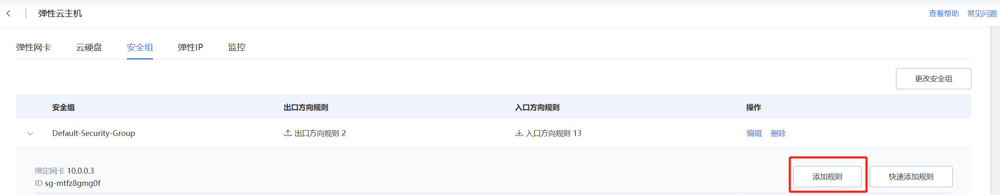

# dify部署

## docker安装

[Ubuntu | Docker Docs](https://docs.docker.com/engine/install/ubuntu/#installation-methods)

```bash
# Add Docker's official GPG key:
apt-get update
apt-get install ca-certificates curl
install -m 0755 -d /etc/apt/keyrings
curl -fsSL https://download.docker.com/linux/ubuntu/gpg -o /etc/apt/keyrings/docker.asc
chmod a+r /etc/apt/keyrings/docker.asc

# Add the repository to Apt sources:
echo \
  "deb [arch=$(dpkg --print-architecture) signed-by=/etc/apt/keyrings/docker.asc] https://download.docker.com/linux/ubuntu \
  $(. /etc/os-release && echo "${UBUNTU_CODENAME:-$VERSION_CODENAME}") stable" | \
  tee /etc/apt/sources.list.d/docker.list > /dev/null
apt-get update
```

```bash
apt-get install docker-ce docker-ce-cli containerd.io docker-buildx-plugin docker-compose-plugin
```

### docker镜像源配置

[Docker换源加速(更换镜像源)详细教程（2025.1最新可用镜像，全网最详细）【测试成功】 - 知乎](https://zhuanlan.zhihu.com/p/28662850275)

**换源方法-永久换源（推荐）**

**核心思想：修改docker的配置文件 `daemon.json`，将镜像源地址写入其中。**

1. 创建目录（如果已经有该目录，则忽略此步骤）

```text
sudo mkdir -p /etc/docker
```

*知识点补充：添加“-p”，执行此命令会先检查目录是否存在。若不存在，则创建相应目录；否则，不执行任何操作。因此**不管是否有该目录，直接执行此命令都没问题，不会报错**。

**通过文本编辑器打开`daemon.json`，然后粘贴**

首先打开配置文件：

```bash
sudo nano /etc/docker/daemon.json
```

然后直接粘贴下列内容：

```text
{
    "registry-mirrors": [
   "https://docker.m.daocloud.io",
   "https://docker.imgdb.de",
   "https://docker-0.unsee.tech",
   "https://docker.hlmirror.com",
   "https://cjie.eu.org"
    ]
}
```

重启docker服务

```bash
sudo systemctl daemon-reload 
sudo systemctl restart docker
```

## Dify安装

```bash
git clone https://github.com/langgenius/dify.git
cd dify
cd docker
cp .env.example .env
docker compose up -d
```

## Dify端口修改

[修改DIFY默认端口号_dify修改端口-CSDN博客](https://blog.csdn.net/weixin_42635073/article/details/146157197)

1. 修改.env文件中EXPOSE_NGINX_PORT端口号位

   /dify/docker文件目录下

   ```bash
   nano .env
   ```

   搜索代码位置：`^w EXPOSE_NGINX_PORT`

   修改EXPOSE_NGINX_PORT=8081（或其他端口）

2. down掉docker-compose

   ```bash
   docker compose down
   ```

3. 启动dify所有服务
   ```bash
   docker compose up -d
   ```

4. 配置天翼云安全组

   

   添加相应的端口地址

   
